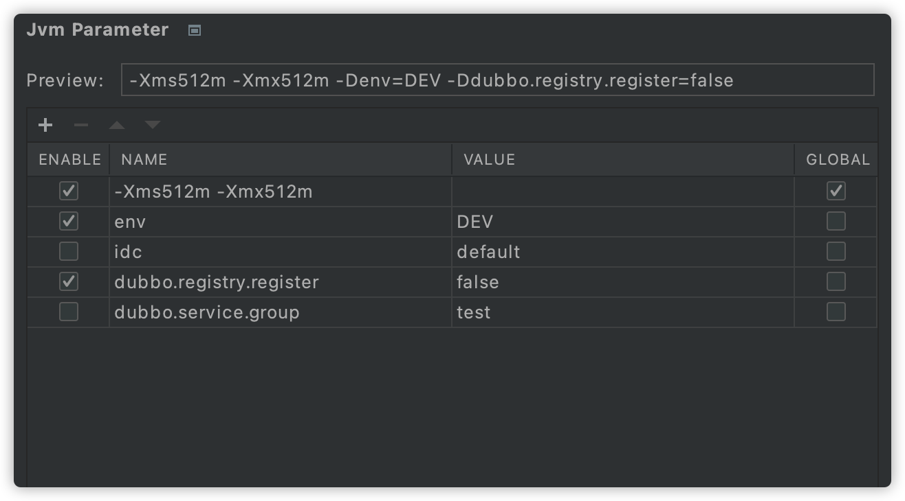

# [jvm-parameter-intellij-plugin](https://plugins.jetbrains.com/plugin/13204-jvm-parameter)

[简体中文](./README.zh_CN.md)

Manage jvm run parameter for your app conveniently. Enabled jvm parameters will be added to application run option when running.

If this plugin helps, please **🌟 Star** and [Rating](https://plugins.jetbrains.com/plugin/13204-jvm-parameter/reviews)! If you have any good idea, please let me know.

## Install
- **Using IDE plugin system**

Recommended <kbd>Preferences(Settings)</kbd> > <kbd>Plugins</kbd> > <kbd>Browse repositories...</kbd> > <kbd>find "Jvm Parameter"</kbd> > <kbd>Install Plugin</kbd>

- **Local Install**

Download plugin form <kbd>distributions/jvm-parameter-intellij-plugin-x.x.x.zip</kbd>, then <kbd>Preferences(Settings)</kbd> > <kbd>Plugins</kbd> > <kbd>Install Plugin from Disk...</kbd>

## Usage
After installed this plugin, you can add custom parameter in `Jvm Parameter` setting.

## Contact & Feedback
[Issues](https://github.com/huzunrong/jvm-parameter-intellij-plugin/issues) | [Email](mailto:huzunrong@foxmail.com) | [Ratings & Previews](https://plugins.jetbrains.com/plugin/13204-jvm-parameter/reviews)

> 注意  
> 反馈时请务必附上必要信息：Idea版本、RESTKit插件版本、异常内容、复现方式(如果有)、诉求等。
