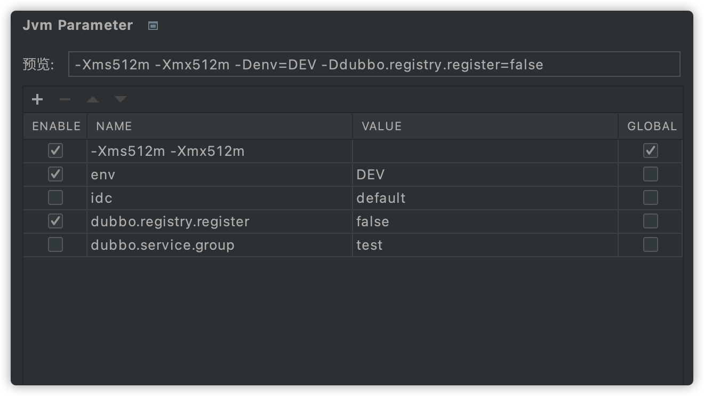

# jvm-parameter-intellij-plugin

方便地管理Jvm运行参数，启动应用时，启用的参数将被自动设置到jvm启动参数中。

如果你觉得本插件不错，请赏个好评吧，同时也欢迎提供宝贵的建议。🌟 Star | [Ratings](https://plugins.jetbrains.com/plugin/13204-jvm-parameter/reviews)

## 功能
- 项目级参数管理
- 全局(跨项目)参数管理

## 安装
- **插件市场安装**

推荐 <kbd>Preferences(Settings)</kbd> > <kbd>Plugins</kbd> > <kbd>Browse repositories...</kbd> > <kbd>输入"Jvm Parameter"</kbd> > <kbd>点击Install</kbd>

## 使用

安装完成后，在`Jvm Parameter`插件设置中添加jvm参数。

- 预览：预览启用的参数（鼠标Hover时可换行查看）
- 参数表格说明

|列名|描述|
| --- | --- |
|ENABLE|是否启用|
|NAME|参数key，不可为空|
|VALUE|参数value，为空时，生成的内容为NAME内容|
|GLOBAL|是否为全局参数|

- 快速生成jvm参数：点击`预览`标签生成常用的参数

## 联系 & 反馈

[Issues](https://github.com/newhoo/jvm-parameter-intellij-plugin/issues) | [Email](mailto:huzunrong@foxmail.com) | [Ratings & Previews](https://plugins.jetbrains.com/plugin/13204-jvm-parameter/reviews)

> 注意  
> 反馈时请务必附上必要信息：Idea版本、插件版本、异常内容、复现方式(如果有)、诉求等。

## 支持作者
如果觉得本插件不错，提升了你的开发效率，那么可以请作者喝杯咖啡吧～您的支持是鼓励我前行的动力，非常感谢。

